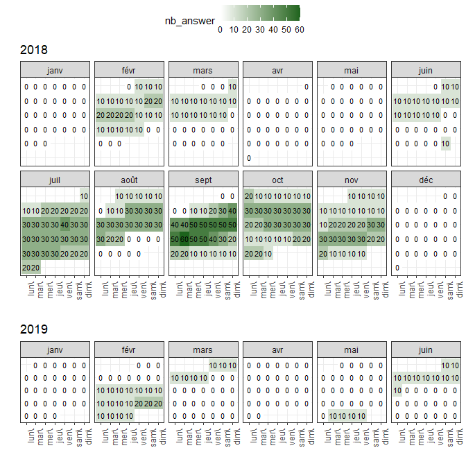

<!-- README.md is generated from README.Rmd. Please edit that file -->

<br>

# esmtools

<!-- badges: start -->
<p align="center">
<a href="https://www.repostatus.org/#active"></a>
<!-- <a href="https://cran.r-project.org/package=esmtools "></a> -->
</p>
<!-- badges: end -->

This R package proposes tools for preprocessing and analyzing data
collected through Ecological Momentary Assessment (EMA) or Experience
Sampling Method (ESM) studies. The ‘esmtools’ package provides a range
of functions to support preprocessing, to help researchers gain valuable
insights from their datasets, and to help report their preprocessing
practices and the quality of the preprocessing of the dataset.

It has been developed as part of a set of tools introduced by Revol and
al. (in preparation). Among developed tools, you can find the **ESM
preprocessing Gallery** (<https://preprocess.esmtools.com/>) which
provides instructions, R code, and practical examples to preprocess your
ESM dataset following a 5 steps framework.

Please remember to cite us if you find our package, framework, and
resources helpful in your study:

- Revol, J., Carlier, C., Lafit, G., Verhees, M., Sels, L., &
  Ceulemans, E. (in preparation). *Preprocessing ESM data: A
  step-by-step framework, reporting templates, and R code website*

## Installation

You can install the package like so:

    install.packages("esmtools")

<!-- remotes::install_gitlab("ppw-okpiv/researchers/u0148925/esmtools", host="https://gitlab.kuleuven.be", force=TRUE) -->

Once installed, you can load the package, as follows:

    library(esmtools)

To learn more about the available functions and their usage, please
refer to the documentation: <https://package.esmtools.com/>.

## Plot example

The calendar plot can provide a comprehensive overview of the time the
data was collected, allowing you to identify periods (e.g., holidays
vs. regular weeks), or detect missing observations for the whole dataset
or a specific participant.

<style>
.esmtools-container{
  &#10;}
.esmtools-container-open {
  border: 2px solid #2780e3;
  border-radius: 7px;
  margin: 0 -1em;
  padding: .4em 1em;
}
.esmtools-btn{
  display:inline-block;
  padding:0.35em 1.2em;
  border:0.2em solid #2780e3;
  background-color:#2780e3;
  margin:0 0.3em 0.3em 0;
  border-radius:0.12em;
  box-sizing: border-box;
  text-decoration:none;
  font-family:'Roboto',sans-serif;
  font-weight: bold;
  color:#FFFFFF;
  text-align:center;
  transition: all 0.2s;
  margin: 4px 0px 4px 4px;
}
.esmtools-btn:hover{
  color:#000000;
  background-color:#FFFFFF;
}
/* Highligh issue text */
.esm-issue{
    font-weight: bold;
    color:#e61919;
    text-decoration: underline #e61919 2px;
}
&#10;/* Highlight data inspection text */
.esm-inspect{
    font-weight: bold;
    text-decoration: underline 2px;
}
&#10;/* Highlight data modification text */
.esm-mod{
    font-weight: bold;
    color:#0088a3;
    text-decoration: underline #0088a3 2px;
}
/* Warning message: hidden content */
.warning_hide{
    font-weight: bold;
    margin: -.4em 0em 1em 2px;
    color: #595959;
}
</style>
<script>
function esmtools_toggleContent(button) {
    var parentDiv = button.parentElement;
    var childNodes = parentDiv.childNodes;
    &#10;    // Toggle the 'esmtools-btn-open' class on the parent div
    parentDiv.classList.toggle("esmtools-container-open");
&#10;    for (var i = 2; i < childNodes.length; i++) {
      var node = childNodes[i];
      // if (!node.classList.contains("content-container")){
          if (node.nodeType === Node.ELEMENT_NODE) {
              if (node.style.display === "none") {
                  node.style.display = "block";
                  console.log("ok")
              } else {
                  node.style.display = "none";
              }
          }
      // }
    }
}
</script>

<style>
.esmtools-container{
  &#10;}
.esmtools-container-open {
  border: 2px solid #2780e3;
  border-radius: 7px;
  margin: 0 -1em;
  padding: .4em 1em;
}
.esmtools-btn{
  display:inline-block;
  padding:0.35em 1.2em;
  border:0.2em solid #2780e3;
  background-color:#2780e3;
  margin:0 0.3em 0.3em 0;
  border-radius:0.12em;
  box-sizing: border-box;
  text-decoration:none;
  font-family:'Roboto',sans-serif;
  font-weight: bold;
  color:#FFFFFF;
  text-align:center;
  transition: all 0.2s;
  margin: 4px 0px 4px 4px;
}
.esmtools-btn:hover{
  color:#000000;
  background-color:#FFFFFF;
}
/* Highligh issue text */
.esm-issue{
    font-weight: bold;
    color:#e61919;
    text-decoration: underline #e61919 2px;
}
&#10;/* Highlight data inspection text */
.esm-inspect{
    font-weight: bold;
    text-decoration: underline 2px;
}
&#10;/* Highlight data modification text */
.esm-mod{
    font-weight: bold;
    color:#0088a3;
    text-decoration: underline #0088a3 2px;
}
/* Warning message: hidden content */
.warning_hide{
    font-weight: bold;
    margin: -.4em 0em 1em 2px;
    color: #595959;
}
</style>
<script>
function esmtools_toggleContent(button) {
    var parentDiv = button.parentElement;
    var childNodes = parentDiv.childNodes;
    &#10;    // Toggle the 'esmtools-btn-open' class on the parent div
    parentDiv.classList.toggle("esmtools-container-open");
&#10;    for (var i = 2; i < childNodes.length; i++) {
      var node = childNodes[i];
      // if (!node.classList.contains("content-container")){
          if (node.nodeType === Node.ELEMENT_NODE) {
              if (node.style.display === "none") {
                  node.style.display = "block";
                  console.log("ok")
              } else {
                  node.style.display = "none";
              }
          }
      // }
    }
}
</script>

## Templates

‘esmtools’ provides a set of RMarkdown templates that are bundled with
the package. The templates are designed to assist in the reporting of
the preprocessing phase and the assessment of data quality, allowing
researchers to document and share their data preprocessing workflows
efficiently. These templates can be accessed using the
**‘esmtools::use_template()’** function, which copies the template files
to your working directory. Available templates are: “preprocess_report”,
“advanced_preprocess_report”, “data_quality_report”. For instance:

    esmtools::use_template("preprocess_report")

For further information, please refer to the [Preprocessing
report](https://preprocess.esmtools.com/pages/90_Preprocessing_report.html)
and the [Data characteristics
report](https://preprocess.esmtools.com/pages/90_Data_characteristics_report.html)
topics of the [Preprocessing ESM
Gallery](https://preprocess.esmtools.com/).

## Reporting tool examples

Among the functions of this package, you can find functions that support
reporting the preprocessing steps. For instance, you can highlight part
of the text using the ‘txt()’ function:

<span class="esm-mod"> Modification 1:</span> The value of the x
variable has been changed to …

Additionally, the ‘button()’ and ‘endbutton()’ functions from the
‘esmtools’ package delimite part of the document that can be revealed
using a button. It is particularly useful to hide non-essential elements
(but still important to report) to improve readibility.

<div class='esmtools-container'>
<button class="esmtools-btn" onclick="esmtools_toggleContent(this)">
Description
</button>
<p>
<div style='display:none;'>
&#10;
<style>
.esmtools-container{
  &#10;}
.esmtools-container-open {
  border: 2px solid #2780e3;
  border-radius: 7px;
  margin: 0 -1em;
  padding: .4em 1em;
}
.esmtools-btn{
  display:inline-block;
  padding:0.35em 1.2em;
  border:0.2em solid #2780e3;
  background-color:#2780e3;
  margin:0 0.3em 0.3em 0;
  border-radius:0.12em;
  box-sizing: border-box;
  text-decoration:none;
  font-family:'Roboto',sans-serif;
  font-weight: bold;
  color:#FFFFFF;
  text-align:center;
  transition: all 0.2s;
  margin: 4px 0px 4px 4px;
}
.esmtools-btn:hover{
  color:#000000;
  background-color:#FFFFFF;
}
/* Highligh issue text */
.esm-issue{
    font-weight: bold;
    color:#e61919;
    text-decoration: underline #e61919 2px;
}
&#10;/* Highlight data inspection text */
.esm-inspect{
    font-weight: bold;
    text-decoration: underline 2px;
}
&#10;/* Highlight data modification text */
.esm-mod{
    font-weight: bold;
    color:#0088a3;
    text-decoration: underline #0088a3 2px;
}
/* Warning message: hidden content */
.warning_hide{
    font-weight: bold;
    margin: -.4em 0em 1em 2px;
    color: #595959;
}
</style>
<script>
function esmtools_toggleContent(button) {
    var parentDiv = button.parentElement;
    var childNodes = parentDiv.childNodes;
    &#10;    // Toggle the 'esmtools-btn-open' class on the parent div
    parentDiv.classList.toggle("esmtools-container-open");
&#10;    for (var i = 2; i < childNodes.length; i++) {
      var node = childNodes[i];
      // if (!node.classList.contains("content-container")){
          if (node.nodeType === Node.ELEMENT_NODE) {
              if (node.style.display === "none") {
                  node.style.display = "block";
                  console.log("ok")
              } else {
                  node.style.display = "none";
              }
          }
      // }
    }
}
</script>

``` r
print(1 + 1)
#> [1] 2
```

<style>
.esmtools-container{
  &#10;}
.esmtools-container-open {
  border: 2px solid #2780e3;
  border-radius: 7px;
  margin: 0 -1em;
  padding: .4em 1em;
}
.esmtools-btn{
  display:inline-block;
  padding:0.35em 1.2em;
  border:0.2em solid #2780e3;
  background-color:#2780e3;
  margin:0 0.3em 0.3em 0;
  border-radius:0.12em;
  box-sizing: border-box;
  text-decoration:none;
  font-family:'Roboto',sans-serif;
  font-weight: bold;
  color:#FFFFFF;
  text-align:center;
  transition: all 0.2s;
  margin: 4px 0px 4px 4px;
}
.esmtools-btn:hover{
  color:#000000;
  background-color:#FFFFFF;
}
/* Highligh issue text */
.esm-issue{
    font-weight: bold;
    color:#e61919;
    text-decoration: underline #e61919 2px;
}
&#10;/* Highlight data inspection text */
.esm-inspect{
    font-weight: bold;
    text-decoration: underline 2px;
}
&#10;/* Highlight data modification text */
.esm-mod{
    font-weight: bold;
    color:#0088a3;
    text-decoration: underline #0088a3 2px;
}
/* Warning message: hidden content */
.warning_hide{
    font-weight: bold;
    margin: -.4em 0em 1em 2px;
    color: #595959;
}
</style>
<script>
function esmtools_toggleContent(button) {
    var parentDiv = button.parentElement;
    var childNodes = parentDiv.childNodes;
    &#10;    // Toggle the 'esmtools-btn-open' class on the parent div
    parentDiv.classList.toggle("esmtools-container-open");
&#10;    for (var i = 2; i < childNodes.length; i++) {
      var node = childNodes[i];
      // if (!node.classList.contains("content-container")){
          if (node.nodeType === Node.ELEMENT_NODE) {
              if (node.style.display === "none") {
                  node.style.display = "block";
                  console.log("ok")
              } else {
                  node.style.display = "none";
              }
          }
      // }
    }
}
</script>

``` r
print(2 + 2)
#> [1] 4
```

<p>
</div>
</div>
</p>

## Datasets examples

The package contains three dataset examples. The first one is a
simulated dataset (**‘esmdata_sim’**) that is used in the [ESM
Preprocessing Gallery](https://preprocess.esmtools.com) website (for
further details see <https://preprocess.esmtools.com/terminology.html>).
The second dataset (**‘esmdata_raw’**) is used as an illustrative
dataset in the article (further details in the article). Finally, the
third dataset (**‘esmdata_preprocessed’**), is the output of the
preprocessing applied to the raw dataset. The preprocessing that was
done can be found in the associated preprocessing report (for further
details see [the
report](https://gitlab.kuleuven.be/ppw-okpiv/researchers/u0148925/esm_preprocessing_gallery/-/blob/master/report_examples/Data_characteristics_report_example.html)).

There are two ways to import the datasets:

- **Using the name** of the dataset.

<style>
.esmtools-container{
  &#10;}
.esmtools-container-open {
  border: 2px solid #2780e3;
  border-radius: 7px;
  margin: 0 -1em;
  padding: .4em 1em;
}
.esmtools-btn{
  display:inline-block;
  padding:0.35em 1.2em;
  border:0.2em solid #2780e3;
  background-color:#2780e3;
  margin:0 0.3em 0.3em 0;
  border-radius:0.12em;
  box-sizing: border-box;
  text-decoration:none;
  font-family:'Roboto',sans-serif;
  font-weight: bold;
  color:#FFFFFF;
  text-align:center;
  transition: all 0.2s;
  margin: 4px 0px 4px 4px;
}
.esmtools-btn:hover{
  color:#000000;
  background-color:#FFFFFF;
}
/* Highligh issue text */
.esm-issue{
    font-weight: bold;
    color:#e61919;
    text-decoration: underline #e61919 2px;
}
&#10;/* Highlight data inspection text */
.esm-inspect{
    font-weight: bold;
    text-decoration: underline 2px;
}
&#10;/* Highlight data modification text */
.esm-mod{
    font-weight: bold;
    color:#0088a3;
    text-decoration: underline #0088a3 2px;
}
/* Warning message: hidden content */
.warning_hide{
    font-weight: bold;
    margin: -.4em 0em 1em 2px;
    color: #595959;
}
</style>
<script>
function esmtools_toggleContent(button) {
    var parentDiv = button.parentElement;
    var childNodes = parentDiv.childNodes;
    &#10;    // Toggle the 'esmtools-btn-open' class on the parent div
    parentDiv.classList.toggle("esmtools-container-open");
&#10;    for (var i = 2; i < childNodes.length; i++) {
      var node = childNodes[i];
      // if (!node.classList.contains("content-container")){
          if (node.nodeType === Node.ELEMENT_NODE) {
              if (node.style.display === "none") {
                  node.style.display = "block";
                  console.log("ok")
              } else {
                  node.style.display = "none";
              }
          }
      // }
    }
}
</script>

``` r
library(esmtools)
data = esmdata_raw
```

- **Importing the csv version** by reconstructing the path to the file
  (stored in the package).

<style>
.esmtools-container{
  &#10;}
.esmtools-container-open {
  border: 2px solid #2780e3;
  border-radius: 7px;
  margin: 0 -1em;
  padding: .4em 1em;
}
.esmtools-btn{
  display:inline-block;
  padding:0.35em 1.2em;
  border:0.2em solid #2780e3;
  background-color:#2780e3;
  margin:0 0.3em 0.3em 0;
  border-radius:0.12em;
  box-sizing: border-box;
  text-decoration:none;
  font-family:'Roboto',sans-serif;
  font-weight: bold;
  color:#FFFFFF;
  text-align:center;
  transition: all 0.2s;
  margin: 4px 0px 4px 4px;
}
.esmtools-btn:hover{
  color:#000000;
  background-color:#FFFFFF;
}
/* Highligh issue text */
.esm-issue{
    font-weight: bold;
    color:#e61919;
    text-decoration: underline #e61919 2px;
}
&#10;/* Highlight data inspection text */
.esm-inspect{
    font-weight: bold;
    text-decoration: underline 2px;
}
&#10;/* Highlight data modification text */
.esm-mod{
    font-weight: bold;
    color:#0088a3;
    text-decoration: underline #0088a3 2px;
}
/* Warning message: hidden content */
.warning_hide{
    font-weight: bold;
    margin: -.4em 0em 1em 2px;
    color: #595959;
}
</style>
<script>
function esmtools_toggleContent(button) {
    var parentDiv = button.parentElement;
    var childNodes = parentDiv.childNodes;
    &#10;    // Toggle the 'esmtools-btn-open' class on the parent div
    parentDiv.classList.toggle("esmtools-container-open");
&#10;    for (var i = 2; i < childNodes.length; i++) {
      var node = childNodes[i];
      // if (!node.classList.contains("content-container")){
          if (node.nodeType === Node.ELEMENT_NODE) {
              if (node.style.display === "none") {
                  node.style.display = "block";
                  console.log("ok")
              } else {
                  node.style.display = "none";
              }
          }
      // }
    }
}
</script>

``` r
file_path = system.file("extdata", "esmdata_raw.csv", package="esmtools")
data = read.csv(file_path)
```

## About

To cite esmtools, please use:

- Revol, J., Carlier, C., Lafit, G., Verhees, M., Sels, L., &
  Ceulemans, E. (2023). *Preprocessing ESM data: a step-by-step
  framework, tutorial website, R package, and reporting templates*

For any questions, bug reports, or suggestions, please reach out to our
team:

- Email: <jordan.revol@kuleuven.be>
- [Report an
  issue](https://gitlab.kuleuven.be/ppw-okpiv/researchers/u0148925/esmtools/-/issues)
- [Repository on
  GitLab](https://gitlab.kuleuven.be/ppw-okpiv/researchers/u0148925/esmtools)

We value your feedback and are committed to improving ‘esmtools’ based
on your needs and requirements.

## Licence

The package source code in this repository is licensed under the [GNU
General Public License, version
3](https://www.gnu.org/licenses/gpl-3.0.en.html#license-text) license.
The documentation, vignettes, and other website materials by Jordan
Revol are licensed under [CC BY
4.0](https://creativecommons.org/licenses/by/4.0/?ref=chooser-v1).
